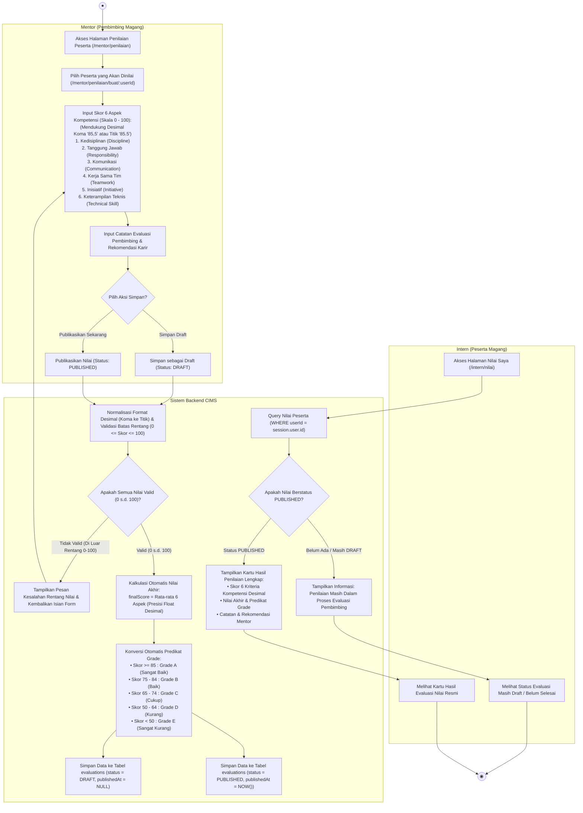

# Activity Diagram - Penilaian Kinerja Magang (Evaluasi)

## 1. Tujuan Diagram
Diagram ini memodelkan alur penilaian performa peserta magang oleh **Mentor** berbasis 6 kriteria kompetensi standar, kalkulasi otomatis nilai akhir dan konversi predikat nilai (*grade huruf*), pengelolaan status (*Draft* / *Published*), serta kontrol visibilitas kartu nilai bagi peserta magang (**Intern**).

---

## 2. Activity Diagram (Mermaid)

---

## 3. Penjelasan Alur Aktivitas

1. **Pengukuran 6 Aspek Kinerja & Fleksibilitas Desimal:** Mentor mengevaluasi peserta magang berdasarkan 6 indikator kompetensi (Disiplin, Tanggung Jawab, Komunikasi, Kerja Sama Tim, Inisiatif, dan Keterampilan Teknis). Sistem mendukung masukan angka bulat maupun desimal berkoma lokal Indonesia (misal: `85,5`) yang dinormalisasi secara otomatis menjadi angka presisi mengambang (*Float*).
2. **Validasi Batas Rentang Skor Ketat:** Sistem memvalidasi bahwa setiap skor kompetensi berada dalam rentang $0 \le \text{Nilai} \le 100$. Jika ditemukan nilai di luar batas rentang (misal: `-5` atau `120`), penyimpanan ditolak dan formulir dimuat kembali dengan pesan galat validasi spesifik.
3. **Kalkulasi Skor dan Grade Otomatis:** Sistem secara otomatis menghitung nilai akhir rata-rata (*finalScore*) secara presisi desimal dan menentukan predikat huruf (*grade*) standar ($A \ge 85$, $B \ge 75$, $C \ge 65$, $D \ge 50$, $E < 50$).
4. **Kontrol Visibilitas (*Publication Workflow*):**
   - Jika disimpan sebagai `DRAFT`, nilai hanya dapat dilihat dan diedit oleh Mentor. Halaman nilai peserta magang akan menampilkan pesan informatif bahwa penilaian masih disusun oleh pembimbing.
   - Jika disimpan/diubah sebagai `PUBLISHED`, atribut `publishedAt` diisi dengan waktu saat ini, dan kartu hasil evaluasi resmi langsung terbuka dan dapat dilihat oleh peserta magang terkait.

---

## 4. Dasar Implementasi Source Code

- **Route Penilaian:** [`routes/index.js`](file:///d:/cims/cims/routes/index.js) (`/mentor/penilaian`, `/mentor/penilaian/buat/:userId`, `/mentor/penilaian/:id/publish`, `/intern/nilai`)
- **Controller Penilaian:** [`controllers/evaluationController.js`](file:///d:/cims/cims/controllers/evaluationController.js) (Fungsi `mentorCreate`, `mentorUpdate`, `mentorPublish`, `internNilai`)
- **Layanan Penilaian:** [`services/evaluationService.js`](file:///d:/cims/cims/services/evaluationService.js) (Fungsi `calculateScoreAndGrade`, `createEvaluation`, `publishEvaluation`, `getEvaluationByUserId`)
- **Validasi Nilai:** [`utils/validators.js`](file:///d:/cims/cims/utils/validators.js) (Fungsi `validateEvaluation`)
- **Skema Database:** [`prisma/schema.prisma`](file:///d:/cims/cims/prisma/schema.prisma) (`model Evaluation`, `enum EvaluationStatus { DRAFT, PUBLISHED, ARCHIVED }`)
