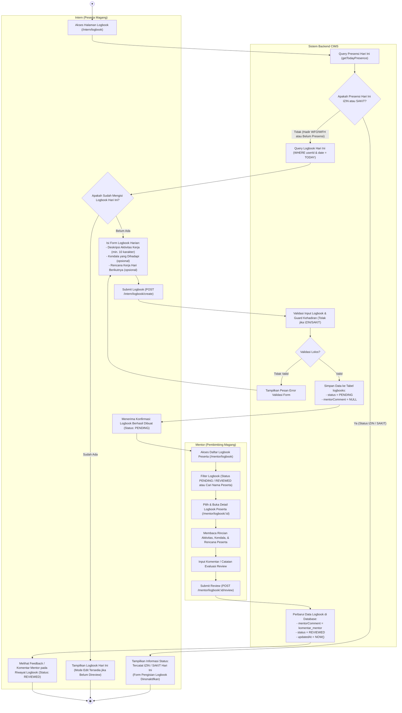

# Activity Diagram - Pengisian dan Review Logbook Harian

## 1. Tujuan Diagram
Diagram ini memodelkan siklus alur kerja pelaporan aktivitas kerja harian oleh peserta magang (**Intern**), validasi pengisian laporan, penyimpanan status awal (`PENDING`), proses peninjauan dan pemberian catatan evaluasi oleh pembimbing (**Mentor**), hingga status laporan berubah menjadi (`REVIEWED`).

---

## 2. Activity Diagram (Mermaid)

---

## 3. Penjelasan Alur Aktivitas

1. **Sinkronisasi Status Kehadiran (Guard Izin/Sakit):** Sistem memeriksa status presensi peserta pada hari tersebut (`getTodayPresence`). Jika peserta tercatat `IZIN` atau `SAKIT`, formulir pengisian logbook otomatis dinonaktifkan untuk mencegah pelaporan kegiatan fiktif di hari ketidakhadiran.
2. **Pengisian Aktivitas Harian:** Pada hari aktif (WFO/WFH), peserta magang mencatat 3 komponen utama: deskripsi aktivitas/pekerjaan yang diselesaikan, kendala teknis yang dihadapi, serta rencana kerja hari berikutnya.
3. **Validasi dan Status Awal:** Sistem memvalidasi bahwa aktivitas diisi dengan detail memadai. Logbook yang baru disimpan otomatis mendapatkan status `PENDING` dan kolom komentar mentor masih bernilai `NULL`.
4. **Pemberian Ulasan oleh Mentor:** Mentor memeriksa antrean logbook pada `/mentor/logbook`. Mentor membaca deskripsi pekerjaan peserta lalu memberikan umpan balik, bimbingan, atau koreksi pada form komentar review.
5. **Perubahan Status:** Saat mentor mengirim komentar review, status logbook otomatis diperbarui menjadi `REVIEWED`. Peserta dapat langsung membaca catatan evaluasi tersebut pada tabel riwayat logbook masing-masing.

---

## 4. Dasar Implementasi Source Code

- **Route Logbook:** [`routes/index.js`](file:///d:/cims/cims/routes/index.js) (`/intern/logbook`, `/mentor/logbook`, `/mentor/logbook/:id/review`)
- **Controller Logbook:** [`controllers/logbookController.js`](file:///d:/cims/cims/controllers/logbookController.js) (Fungsi `internCreateLogbook`, `internLogbookPage`, `mentorReviewLogbook`, `mentorLogbookDetail`)
- **Layanan Logbook:** [`services/logbookService.js`](file:///d:/cims/cims/services/logbookService.js) (Fungsi `createLogbook`, `reviewLogbook`, `getTodayLogbook`, `getLogbookStats`)
- **Validasi Input:** [`utils/validators.js`](file:///d:/cims/cims/utils/validators.js) (Fungsi `validateLogbook`)
- **Skema Database:** [`prisma/schema.prisma`](file:///d:/cims/cims/prisma/schema.prisma) (`model Logbook`, `enum LogbookStatus { PENDING, REVIEWED }`)
