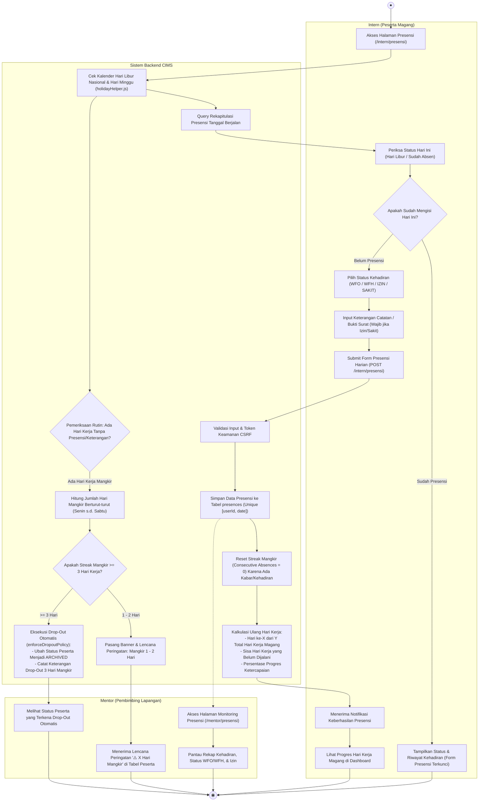

# Activity Diagram - Presensi Harian dan Penegakan Kebijakan Drop-Out 3 Hari Mangkir

## 1. Tujuan Diagram
Diagram ini memodelkan alur pencatatan presensi harian oleh peserta magang (**Intern**), validasi pembatasan kehadiran pada hari kerja, mekanisme pemutusan rangkaian mangkir saat peserta hadir/izin/sakit, serta alur penegakan otomatis kebijakan **Drop-Out (Status ARCHIVED)** apabila peserta tidak masuk kerja selama **3 hari berturut-turut** tanpa keterangan resmi.

---

## 2. Activity Diagram (Mermaid)

---

## 3. Penjelasan Alur Aktivitas Presensi dan Drop-Out

1. **Verifikasi Hari Kerja & Tanggal Merah:**
   Sebelum form presensi dapat diakses, modul [`holidayHelper.js`](file:///d:/cims/cims/utils/holidayHelper.js) memverifikasi apakah hari ini adalah hari kerja (Senin s.d. Sabtu). Hari Minggu dan Hari Libur Nasional resmi dilewati dan tidak dihitung sebagai hari mangkir.
2. **Pencatatan Presensi & Pemutusan Rangkaian Mangkir:**
   Jika peserta mencatatkan presensi (`WFO`, `WFH`, `IZIN`, atau `SAKIT`), sistem menganggap peserta telah memberikan keterangan resmi (*ada kabar*). Akibatnya, hitungan mangkir berturut-turut langsung **direset kembali ke 0**.
3. **Pemberlakuan Kebijakan Drop-Out 3 Hari Mangkir Berturut-turut:**
   - Melalui fungsi `checkConsecutiveUnexcusedAbsences` pada [`presenceService.js`](file:///d:/cims/cims/services/presenceService.js), sistem menelusuri riwayat hari kerja ke belakang.
   - Jika ditemukan **1 s.d. 2 hari kerja berturut-turut** tanpa presensi atau surat izin/sakit, sistem memunculkan banner peringatan dini berwarna kuning bagi peserta dan lencana `⚠️ X Hari Mangkir` bagi mentor.
   - Jika peserta mangkir selama **$\ge 3$ hari kerja berturut-turut**, fungsi `enforceDropoutPolicy` secara otomatis mengubah status akun peserta menjadi `ARCHIVED` (Drop-Out / Tidak Melanjutkan Magang).
4. **Kalkulasi Hari Kerja Terpadu:**
   Sistem menghitung metrik hari kerja secara presisi (hari ke-X dari total Y hari kerja, sisa hari kerja, dan persentase progres ketercapaian) yang ditampilkan dalam bentuk progress bar ramping di dashboard mentor dan intern.

---

## 4. Dasar Implementasi Source Code

- **Layanan Presensi & Kebijakan Mangkir:** [`services/presenceService.js`](file:///d:/cims/cims/services/presenceService.js) (`checkConsecutiveUnexcusedAbsences`, `enforceDropoutPolicy`)
- **Layanan Kalkulasi Progres:** [`services/gamificationService.js`](file:///d:/cims/cims/services/gamificationService.js) (`calculateInternshipProgress`)
- **Kontroler Presensi:** [`controllers/presenceController.js`](file:///d:/cims/cims/controllers/presenceController.js)
- **Helper Hari Libur:** [`utils/holidayHelper.js`](file:///d:/cims/cims/utils/holidayHelper.js)
