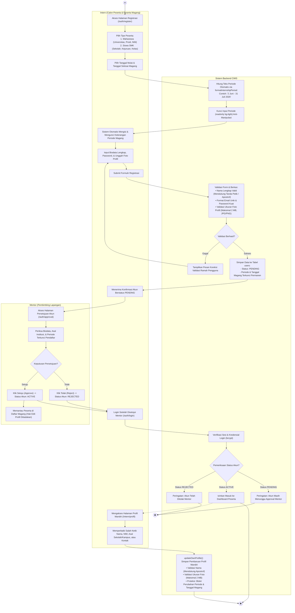

# Activity Diagram - Registrasi Peserta, Penetapan Periode Otomatis, dan Self-Service Profil

## 1. Tujuan Diagram
Diagram ini memodelkan alur pendaftaran akun calon peserta magang (**Intern**), pengisian tanggal magang dengan kalkulasi otomatis keterangan periode yang terkunci (*immutable*), proses persetujuan akun oleh **Mentor**, serta fasilitas pembaruan mandiri (*Self-Service Profil*) oleh peserta untuk memperbaiki salah ketik (*typo*) biodata tanpa intervensi mentor.

---

## 2. Activity Diagram (Mermaid)

---

## 3. Penjelasan Alur Aktivitas

1. **Otomatisasi Periode Magang & Anti-Manipulasi:**
   Saat calon peserta mengisi tanggal mulai (`internshipStartDate`) dan tanggal selesai (`internshipEndDate`), fungsi helper `formatInternshipPeriod` secara *real-time* membentuk format baku bahasa Indonesia (misal: `"2 - 31 Juli 2026"` atau `"2 Juni - 31 Juli 2026"`). Nilai ini berstatus `readonly` dan terkunci permanen di database untuk mencegah manipulasi durasi magang.
2. **Pemisahan Wewenang (Self-Service Profil):**
   - **Peserta:** Memiliki wewenang mandiri penuh melalui `/intern/profil` untuk memperbaiki salah ketik (*typo*) nama lengkap, NIM/NIS, nama universitas/sekolah, program studi/jurusan, kelas, maupun nomor kontak HP.
   - **Mentor:** Tombol pengubahan data profil peserta pada antarmuka pembimbing ditiadakan, sehingga mentor hanya fokus pada fungsi pemantauan, verifikasi, dan penilaian objektif.
3. **Siklus Approval Akun:**
   Akun baru tersimpan dengan status `PENDING`. Mentor memeriksa kredibilitas pendaftar pada halaman `/auth/approval` sebelum memberikan izin masuk (`ACTIVE`).

---

## 4. Dasar Implementasi Source Code

- **Layanan Partisipan & Self-Service Profil:** [`services/participantService.js`](file:///d:/cims/cims/services/participantService.js) (`updateOwnProfile`)
- **Helper Periode Magang:** [`utils/helpers.js`](file:///d:/cims/cims/utils/helpers.js) (`formatInternshipPeriod`)
- **Kontroler Autentikasi:** [`controllers/authController.js`](file:///d:/cims/cims/controllers/authController.js)
- **Tampilan Registrasi & Profil:**
  - [`views/pages/auth/register.ejs`](file:///d:/cims/cims/views/pages/auth/register.ejs)
  - [`views/pages/intern/profil.ejs`](file:///d:/cims/cims/views/pages/intern/profil.ejs)
