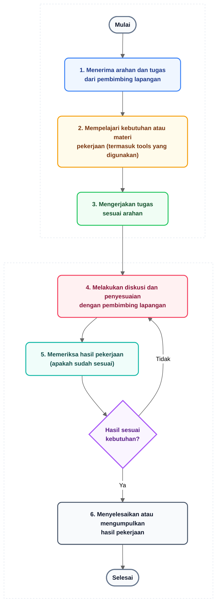

# Alur Kerja Pelaksanaan Magang (Prosedur Pelaksanaan)
**Untuk Bab III: Metode Pelaksanaan (Subbab 3.2 Prosedur Pelaksanaan)**  
*Lokasi Magang: PT Cikara Bakti Nusantara*

---

## 1. Diagram Alur Kerja Pelaksanaan Magang (Format 2 Baris - Direkomendasikan)

Diagram alur berikut mendokumentasikan prosedur pelaksanaan kerja peserta magang di PT Cikara Bakti Nusantara dengan format **2 baris horizontal** dan **tanpa ikon/simbol tambahan** (murni teks dan bentuk geometris formal). Format 2 baris ini sangat ideal untuk halaman dokumen Word A4 Portrait karena:
- **Tidak memakan tempat berlebih** (tinggi diagram proporsional ~7 cm di halaman Word, tidak memenuhi 1 halaman penuh).
- **Isi teks terbaca sangat jelas** (setiap kotak memiliki ruang yang luas sehingga teks tidak menyusut/mengecil).
- **Alur pembacaan natural (Kiri ke Kanan)**: Baris 1 memuat tahapan perencanaan dan pengerjaan (Mulai &rarr; 1 &rarr; 2 &rarr; 3), lalu panah mengalir turun ke Baris 2 yang memuat tahapan diskusi, verifikasi, evaluasi revisi, hingga pengumpulan selesai (4 &rarr; 5 &rarr; Evaluasi &rarr; 6 &rarr; Selesai).

---

## 2. Pilihan Format Alternatif (1 Baris Horizontal Panjang)

Bila diinginkan format 1 baris memanjang penuh:

```mermaid
%%{init: {'theme': 'neutral', 'themeVariables': {'fontSize': '12px', 'fontFamily': 'Inter, Segoe UI, sans-serif'}}}%%
flowchart LR
    classDef startEnd fill:#f8fafc,stroke:#64748b,stroke-width:2px,color:#0f172a,font-weight:bold,rx:20;
    classDef s1 fill:#eff6ff,stroke:#3b82f6,stroke-width:1.8px,color:#1e3a8a,font-weight:600,rx:8;
    classDef s2 fill:#fffbeb,stroke:#f59e0b,stroke-width:1.8px,color:#78350f,font-weight:600,rx:8;
    classDef s3 fill:#f0fdf4,stroke:#22c55e,stroke-width:1.8px,color:#14532d,font-weight:600,rx:8;
    classDef s4 fill:#fff1f2,stroke:#f43f5e,stroke-width:1.8px,color:#881337,font-weight:600,rx:8;
    classDef s5 fill:#f0fdfa,stroke:#14b8a6,stroke-width:1.8px,color:#134e4a,font-weight:600,rx:8;
    classDef dec fill:#faf5ff,stroke:#a855f7,stroke-width:2px,color:#581c87,font-weight:bold;
    classDef s6 fill:#f8fafc,stroke:#475569,stroke-width:1.8px,color:#0f172a,font-weight:600,rx:8;

    Mulai(["Mulai"]):::startEnd --> Step1["1. Menerima arahan<br/>dan tugas dari<br/>pembimbing lapangan"]:::s1
    Step1 --> Step2["2. Mempelajari kebutuhan<br/>atau materi pekerjaan<br/>(termasuk tools yang digunakan)"]:::s2
    Step2 --> Step3["3. Mengerjakan tugas<br/>sesuai arahan"]:::s3
    Step3 --> Step4["4. Melakukan diskusi<br/>dan penyesuaian dengan<br/>pembimbing lapangan"]:::s4
    Step4 --> Step5["5. Memeriksa hasil<br/>pekerjaan (apakah<br/>sudah sesuai)"]:::s5
    Step5 --> Decision{"Hasil sesuai<br/>kebutuhan?"}:::dec
    Decision -- "Tidak" --> Step4
    Decision -- "Ya" --> Step6["6. Menyelesaikan atau<br/>mengumpulkan hasil pekerjaan"]:::s6
    Step6 --> Selesai(["Selesai"]):::startEnd
```

---

## 3. Aset Berkas Gambar Siap Pakai

Seluruh berkas gambar beresolusi tinggi (2x Retina) tanpa ikon telah di-generate dan tersimpan di folder [`docs/diagrams/images/`](./images/):

| Format & Varian | Path Berkas | Deskripsi & Keunggulan |
|---|---|---|
| **PNG 2 Baris (Utama / Direkomendasikan)** | [`images/alur-kerja-magang-2-baris.png`](./images/alur-kerja-magang-2-baris.png) | **Sangat proporsional di Word A4**. Hemat tempat vertikal, tulisan besar, tajam dan sangat mudah dibaca. |
| **SVG 2 Baris (Vektor Murni)** | [`images/alur-kerja-magang-2-baris.svg`](./images/alur-kerja-magang-2-baris.svg) | Grafis vektor independen, dapat diperbesar tanpa pecah resolusi. |
| **SVG Mermaid 2 Baris** | [`images/alur-kerja-magang-2-baris-mermaid.svg`](./images/alur-kerja-magang-2-baris-mermaid.svg) | Render langsung berbasis engine Mermaid. |
| **PNG 1 Baris Horizontal** | [`images/alur-kerja-magang-horizontal-no-icon.png`](./images/alur-kerja-magang-horizontal-no-icon.png) | Alternatif horizontal 1 baris memanjang penuh. |
| **SVG 1 Baris Horizontal** | [`images/alur-kerja-magang-horizontal-no-icon.svg`](./images/alur-kerja-magang-horizontal-no-icon.svg) | Vektor 1 baris horizontal tanpa ikon. |

---

## 4. Penjelasan Rincian Tahapan (Untuk Naskah Subbab 3.2 Laporan KP)

Berikut adalah naskah penjelasan naratif yang dapat langsung dicantumkan pada **Subbab 3.2 Prosedur Pelaksanaan Magang**:

> ### **3.2 Prosedur Pelaksanaan Magang**
>
> Prosedur pelaksanaan kerja praktek di PT Cikara Bakti Nusantara disusun secara terstruktur untuk memastikan setiap penugasan dari pembimbing lapangan dapat diselesaikan dengan standar kualitas industri. Alur kerja pelaksanaan magang digambarkan pada **Gambar 3.1**:
>
> *(Sisipkan berkas `alur-kerja-magang-2-baris.png` di sini)*  
> **Gambar 3.1 Alur Kerja Pelaksanaan Magang di PT Cikara Bakti Nusantara**
>
> Berdasarkan **Gambar 3.1**, tahapan prosedur pelaksanaan magang mencakup siklus berulang sebagai berikut:
>
> 1. **Menerima arahan dan tugas dari pembimbing lapangan**:  
>    Tahap awal di mana pembimbing lapangan (*mentor*) memberikan *briefing*, tujuan penugasan, spesifikasi luaran yang diharapkan, serta tenggat waktu penyelesaian.
> 2. **Mempelajari kebutuhan atau materi pekerjaan (termasuk tools yang digunakan)**:  
>    Peserta magang melakukan riset mandiri, membaca dokumentasi teknis, dan menyiapkan lingkungan kerja serta perangkat lunak pendukung (seperti Photoshop, Canva, Unity, Git, VS Code, atau Node.js) sesuai arahan tugas.
> 3. **Mengerjakan tugas sesuai arahan**:  
>    Proses eksekusi pekerjaan secara aktif dan disiplin berdasarkan rancangan dan instruksi yang telah ditetapkan.
> 4. **Melakukan diskusi dan penyesuaian dengan pembimbing lapangan**:  
>    Sesi konsultasi rutin berkala (*sharing session* atau *standup*) untuk melaporkan progres, mendiskusikan kendala teknis, serta memperoleh masukan perbaikan dari mentor.
> 5. **Memeriksa hasil pekerjaan (apakah sudah sesuai)**:  
>    Evaluasi mandiri (*self-check*) bersama pembimbing lapangan untuk memastikan apakah hasil pekerjaan telah memenuhi kriteria penerimaan.
>    - **Jika Hasil Belum Sesuai (Tidak)**: Alur kerja kembali ke tahapan ke-4 untuk dilakukan penyesuaian, revisi, dan perbaikan detail sesuai catatan pembimbing lapangan.
>    - **Jika Hasil Sudah Sesuai (Ya)**: Pekerjaan dilanjutkan ke tahap finalisasi.
> 6. **Menyelesaikan atau mengumpulkan hasil pekerjaan**:  
>    Tahap akhir penyerahan berkas luaran (seperti aset mockup, build game, repositori kode aplikasi web CIMS, atau berkas laporan) ke sistem penyimpanan resmi perusahaan sebelum dinyatakan selesai.
>
> *Catatan:* Alur kerja ini diterapkan secara konsisten pada seluruh portofolio kegiatan selama magang, meliputi pembuatan 27 template mockup produk, pengembangan game (termasuk kompetisi GameSeed), pembuatan aset dan map 3D/Roblox, hingga proyek akhir perancangan bangun aplikasi web *Cikara Internship Management System* (CIMS).
