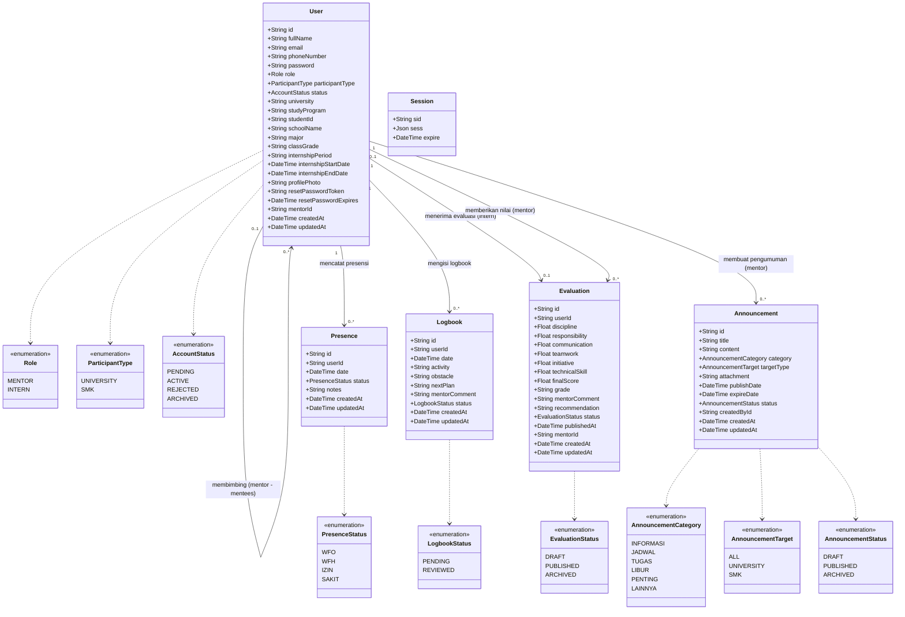

# Class Diagram - Cikara Internship Management System (CIMS)

## 1. Tujuan Diagram
Diagram ini memodelkan struktur kelas entitas data pada sistem CIMS yang diturunkan langsung dari skema Object-Relational Mapping (**Prisma ORM**) di [`prisma/schema.prisma`](file:///d:/cims/cims/prisma/schema.prisma), termasuk atribut tipe data, enumerasi (*enums*), dan kardinalitas relasi antar-kelas.

---

## 2. Class Diagram (Mermaid)

---

## 3. Penjelasan Struktur Model

1. **Model `User` (Multi-Peran & Polimorfik Peserta):** Berfungsi sebagai entitas inti. Atribut `role` membedakan apakah pengguna adalah `MENTOR` atau `INTERN`. Atribut `participantType` menampung variasi data instansi (`UNIVERSITY` untuk Mahasiswa dengan atribut `university`, `studyProgram`, `studentId` atau `SMK` untuk Siswa dengan atribut `schoolName`, `major`, `classGrade`). Relasi *self-referencing* `mentorId` menghubungkan peserta magang dengan pembimbingnya.
2. **Model `Presence` & `Logbook`:** Memiliki integritas data *composite unique constraint* pada `[userId, date]`, memastikan bahwa setiap peserta hanya memiliki tepat satu catatan absensi dan satu catatan logbook pada tanggal tertentu.
3. **Model `Evaluation`:** Memiliki relasi *One-to-One* unik terhadap `userId` peserta magang (`userId @unique`) untuk menjamin satu peserta hanya memiliki satu rekapitulasi penilaian akhir magang yang mencakup 6 indikator kompetensi, nilai akhir (*finalScore*), dan *grade*.
4. **Model `Announcement`:** Memfasilitasi publikasi informasi dan arahan kerja dari mentor kepada peserta magang dengan segmentasi target (Mahasiswa, SMK, atau Seluruh Peserta).
5. **Model `Session`:** Merepresentasikan tabel penyimpanan sesi login server-side dari library `connect-pg-simple`.

---

## 4. Dasar Implementasi Source Code

- **Definisi Model & Relasi:** [`prisma/schema.prisma`](file:///d:/cims/cims/prisma/schema.prisma) (Baris 11–262)
- **Konfigurasi Instance Prisma Client:** [`config/database.js`](file:///d:/cims/cims/config/database.js)
- **Skrip Seeding & Relasi Dummy Data:** [`seed.js`](file:///d:/cims/cims/seed.js)
