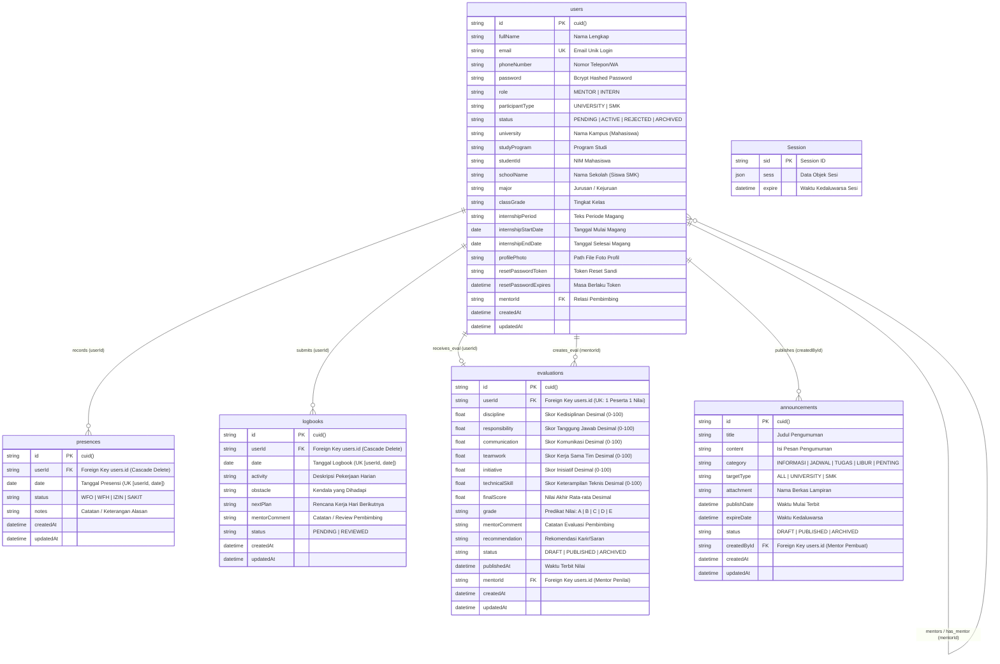

# Entity Relationship Diagram (ERD) - CIMS Database

## 1. Tujuan Diagram
Diagram ini memodelkan relasi fisik basis data relasional PostgreSQL pada sistem CIMS yang dikelola melalui **Prisma ORM** ([`prisma/schema.prisma`](file:///d:/cims/cims/prisma/schema.prisma)). Menampilkan entitas tabel, *Primary Key* (PK), *Foreign Key* (FK), *Unique Key* (UK), atribut data penting, dan kardinalitas relasi antar-tabel.

---

## 2. Entity Relationship Diagram (Mermaid)

---

## 3. Penjelasan Relasi & Batasan Integritas Database

1. **Mapping Nama Tabel:** Nama entitas tabel pada database PostgreSQL dipetakan secara eksplisit dari model Prisma menggunakan anotasi `@@map`:
   - `User` $\rightarrow$ `users`
   - `Presence` $\rightarrow$ `presences`
   - `Logbook` $\rightarrow$ `logbooks`
   - `Announcement` $\rightarrow$ `announcements`
   - `Evaluation` $\rightarrow$ `evaluations`
   - `Session` $\rightarrow$ `Session`
2. **Kardinalitas & Foreign Keys Utama:**
   - `users` ke `presences` (1 : N) dengan `onDelete: Cascade`. Jika akun user dihapus, seluruh riwayat presensinya otomatis terhapus.
   - `users` ke `logbooks` (1 : N) dengan `onDelete: Cascade`.
   - `users` ke `evaluations` (1 : 1 unik) pada `userId`. Menjamin setiap peserta magang hanya memiliki satu rekap evaluasi akhir.
   - `users` ke `announcements` (1 : N) pada `createdById` (mentor pembuat pengumuman).
3. **Composite Unique Constraints:**
   - `presences`: `@@unique([userId, date])` — Menolak duplikasi data absensi pada hari yang sama.
   - `logbooks`: `@@unique([userId, date])` — Menolak pengisian laporan aktivitas ganda pada tanggal yang sama.

---

## 4. Dasar Implementasi Source Code

- **Skema Lengkap Database:** [`prisma/schema.prisma`](file:///d:/cims/cims/prisma/schema.prisma) (Baris 11–195)
- **Migrasi Database:** Direktori [`prisma/migrations/`](file:///d:/cims/cims/prisma/migrations)
- **Konfigurasi Pooler & Driver:** [`app.js`](file:///d:/cims/cims/app.js) (Baris 116–149) dan [`config/database.js`](file:///d:/cims/cims/config/database.js)
