# Incremental Model Development Workflow - CIMS

## 1. Konsep Model Inkremental pada CIMS
Pengembangan *Cikara Internship Management System* (CIMS) di PT Cikara Bakti Nusantara mengadopsi **Incremental Model** (Pressman & Maxim, 2019; Sanmocte & Costales, 2025). Sistem dibagi menjadi 3 tahapan rilis (*increments*) terencana yang saling berkesinambungan. Setiap *increment* melalui siklus lengkap: *Communication & Planning*, *Modeling (Design)*, *Construction (Coding)*, dan *Testing (Verification)*.

---

## 2. Diagram Alur Incremental Model CIMS (Mermaid)

```mermaid
flowchart TD
    subgraph Inc1 ["Increment 1: Core System & Role-Based Access Control (RBAC)"]
        direction TB
        Plan1["1. Analisis Kebutuhan Awal & Planning<br/>- Identifikasi Stakeholder (Admin, Mentor, Intern)<br/>- Skema Database Dasar (User, Profile, Session)"]
        Design1["2. Desain & Modeling Increment 1<br/>- Use Case Login & Registrasi<br/>- Arsitektur MVC Express.js & Prisma Schema"]
        Code1["3. Implementasi Kode Increment 1<br/>- Route Auth & Middleware (isAuthenticated, mentorOnly)<br/>- Dashboard Layout EJS & Bootstrap 5"]
        Test1["4. Pengujian Increment 1<br/>- Black Box Testing: Login, Registrasi, Proteksi URL"]
        Plan1 --> Design1 --> Code1 --> Test1
    end

    subgraph Inc2 ["Increment 2: Monitoring Presensi & Logbook Kegiatan Harian"]
        direction TB
        Plan2["1. Analisis Alur Aktivitas Kerja<br/>- Kebijakan WFO/WFH di PT Cikara Bakti Nusantara<br/>- Format Isian Logbook & Validasi Lapangan"]
        Design2["2. Desain & Modeling Increment 2<br/>- Sequence Diagram Presensi & Logbook<br/>- Relasi Database Presence & Logbook ke User"]
        Code2["3. Implementasi Kode Increment 2<br/>- presenceController & logbookController<br/>- Kalender Interaktif & Status Approval Mentor"]
        Test2["4. Pengujian Increment 2<br/>- Black Box Testing: Input Hadir/Izin, CRUD Logbook, Verifikasi Mentor"]
        Plan2 --> Design2 --> Code2 --> Test2
    end

    subgraph Inc3 ["Increment 3: Evaluasi Kompetensi, Security Hardening & Optimasi Antarmuka Mobile"]
        direction TB
        Plan3["1. Analisis Luaran & Keamanan Sistem<br/>- 6 Kriteria Penilaian Kompetensi Magang<br/>- Kebutuhan Audit Keamanan & Ergonomi Mobile"]
        Design3["2. Desain & Modeling Increment 3<br/>- Diagram Alur Evaluasi & Publikasi Nilai<br/>- Arsitektur Keamanan CSRF, Session, Helmet"]
        Code3["3. Implementasi Kode Increment 3<br/>- evaluationController.js & Paginasi Riwayat<br/>- Middleware CSRF Double-Submit & Helmet Headers"]
        Test3["4. Pengujian Terpadu Increment 3<br/>- Black Box Testing & Regression Suite Komprehensif"]
        Plan3 --> Design3 --> Code3 --> Test3
    end

    Inc1 ==>|Fondasi Pengguna Siap| Inc2
    Inc2 ==>|Data Presensi & Logbook Siap| Inc3
    Inc3 ==> FinalSystem(["CIMS Siap Digunakan Secara Penuh (Production-Ready)"])
```

---

## 3. Rincian Fitur per Increment

| Increment | Fokus Fungsional | Komponen Teknis | Pengujian |
|---|---|---|---|
| **Increment 1** | Autentikasi Pengguna, Registrasi Peserta, Periode Terkunci Otomatis, Approval Mentor, dan Self-Service Profil | Node.js, Express.js, Prisma ORM, PostgreSQL, bcrypt, express-session | Black Box Testing modul Autentikasi (Validasi Login, Proteksi Role, Periode Immutability) |
| **Increment 2** | Presensi Digital (WFO, WFH, Sakit, Izin), Integrasi Libur Nasional, Penegakan Drop-Out 3 Hari, Bar Hari Kerja, dan Logbook | EJS Templates, Bootstrap 5, presenceController, logbookController, holidayHelper | Black Box Testing alur presensi harian, streak reset, drop-out otomatis, dan siklus approval logbook |
| **Increment 3** | Evaluasi 6 Kriteria Nilai, Publikasi Kartu Hasil Penilaian, Paginasi Riwayat Mobile, Proteksi CSRF, dan Helmet Headers | evaluationController, csrf middleware, helmet security headers, EJS pagination | Full Black Box Regression Testing (134+ Skenario Terverifikasi) |
