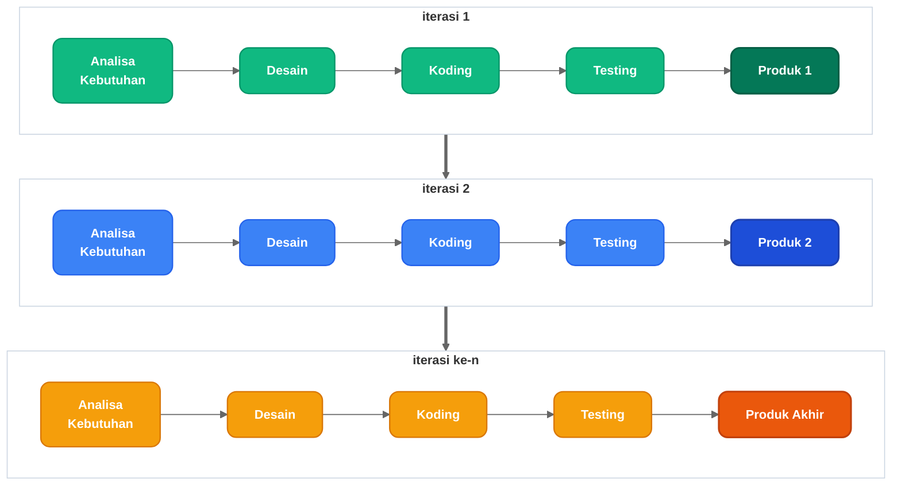

# Teori Model Pengembangan Inkremental (The Incremental Model)
**Untuk Bab II: Tinjauan Pustaka / Landasan Teori**  
*Rujukan Teori: Roger S. Pressman & Bruce R. Maxim (Software Engineering: A Practitioner's Approach) dan Ian Sommerville (Software Engineering)*

---

## 1. Diagram Alur Model Inkremental (Redesain Modern Sesuai Format Contoh)

Diagram ini mengadopsi struktur alur iteratif berulang persis sesuai contoh yang Anda berikan (tanpa mengubah teks atau alur), namun dengan desain yang telah diperbarui secara menyeluruh (tipografi elegan, sudut membulat, kartu berkontur halus, dan skema warna harmonis berstandar akademik):



### Aset Gambar Redesain Siap Pakai:
- **PNG Resolusi Tinggi (Siap Word):** [`images/model-incremental-iterasi-bersih.png`](./images/model-incremental-iterasi-bersih.png)
- **Vektor Card Modern (SVG):** [`images/alur-model-incremental-modern.svg`](./images/alur-model-incremental-modern.svg)
- **Vektor Mermaid (SVG):** [`images/model-incremental-iterasi-bersih.svg`](./images/model-incremental-iterasi-bersih.svg)

---

## 2. Diagram Alur Model Inkremental (5 Aktivitas Kerangka Kerja Pressman)

```mermaid
flowchart TD
    %% Styling
    classDef comm fill:#eff6ff,stroke:#3b82f6,stroke-width:1.5px,color:#1e3a8a;
    classDef plan fill:#e0e7ff,stroke:#6366f1,stroke-width:1.5px,color:#312e81;
    classDef model fill:#fef3c7,stroke:#f59e0b,stroke-width:1.5px,color:#78350f;
    classDef const fill:#fce7f3,stroke:#ec4899,stroke-width:1.5px,color:#831843;
    classDef deploy fill:#dcfce7,stroke:#22c55e,stroke-width:1.5px,color:#14532d;
    classDef release1 fill:#2563eb,stroke:#1d4ed8,stroke-width:2px,color:#ffffff,font-weight:bold;
    classDef release2 fill:#16a34a,stroke:#15803d,stroke-width:2px,color:#ffffff,font-weight:bold;
    classDef releaseN fill:#7c3aed,stroke:#6d28d9,stroke-width:2px,color:#ffffff,font-weight:bold;

    subgraph Inc1 ["INKREMEN 1 (PENGEMBANGAN PRODUK INTI / CORE PRODUCT)"]
        direction LR
        C1["Komunikasi<br/><i>Communication</i>"]:::comm --> P1["Perencanaan<br/><i>Planning</i>"]:::plan
        P1 --> M1["Pemodelan<br/><i>Modeling</i><br/>(Analisis & Desain)"]:::model
        M1 --> K1["Konstruksi<br/><i>Construction</i><br/>(Koding & Uji)"]:::const
        K1 --> D1["Penyerahan<br/><i>Deployment</i><br/>(Delivery & Evaluasi)"]:::deploy
        D1 --> R1(["📦 Rilis Inkremen 1<br/>(Produk Inti / Core Product)"]):::release1
    end

    subgraph Inc2 ["INKREMEN 2 (PENGEMBANGAN FITUR TAMBAHAN)"]
        direction LR
        C2["Komunikasi<br/><i>Communication</i>"]:::comm --> P2["Perencanaan<br/><i>Planning</i>"]:::plan
        P2 --> M2["Pemodelan<br/><i>Modeling</i><br/>(Analisis & Desain)"]:::model
        M2 --> K2["Konstruksi<br/><i>Construction</i><br/>(Koding & Uji)"]:::const
        K2 --> D2["Penyerahan<br/><i>Deployment</i><br/>(Delivery & Evaluasi)"]:::deploy
        D2 --> R2(["📦 Rilis Inkremen 2<br/>(Fitur Bertambah)"]):::release2
    end

    subgraph IncN ["INKREMEN n (PENYEMPURNAAN & INTEGRASI SISTEM LENGKAP)"]
        direction LR
        CN["Komunikasi<br/><i>Communication</i>"]:::comm --> PN["Perencanaan<br/><i>Planning</i>"]:::plan
        PN --> MN["Pemodelan<br/><i>Modeling</i><br/>(Analisis & Desain)"]:::model
        MN --> KN["Konstruksi<br/><i>Construction</i><br/>(Koding & Uji)"]:::const
        KN --> DN["Penyerahan<br/><i>Deployment</i><br/>(Delivery & Evaluasi)"]:::deploy
        DN --> RN(["🚀 Rilis Akhir Perangkat Lunak<br/>(Sistem Lengkap / Final Product)"]):::releaseN
    end

    %% Siklus Umpan Balik (Feedback Loops)
    R1 -.->|"Evaluasi Pengguna & Umpan Balik (Customer Feedback)"| C2
    R2 -.->|"Evaluasi Pengguna & Kebutuhan Fitur Akhir"| CN
```



---

## 2. Aset Gambar Diagram Siap Pakai

File gambar untuk diagram di atas telah di-generate dan tersimpan di folder [`docs/diagrams/images/`](./images/):

1. **Format PNG (Siap dimasukkan ke Microsoft Word):**  
   [`images/00-incremental-model-theory.png`](./images/00-incremental-model-theory.png)  
   *Resolusi tinggi, latar belakang transparan/bersih, teks tajam.*
2. **Format Vektor SVG (Untuk tampilan web & cetak tanpa pecah):**  
   [`images/00-incremental-model-theory.svg`](./images/00-incremental-model-theory.svg)
3. **Format Infografis Akademik Vektor (Staggered Waterfall dengan Sumbu Waktu Kalender):**  
   [`images/00-incremental-model-theory-vector.svg`](./images/00-incremental-model-theory-vector.svg)

---

## 3. Naskah Teori untuk Bab II (Tinjauan Pustaka)

Berikut adalah draf narasi akademik lengkap yang dapat langsung disalin ke **Subbab 2.2 Laporan Kerja Praktek / Skripsi**:

### 2.2.1 Definisi Model Inkremental (The Incremental Model)
Model Inkremental (*Incremental Model*) merupakan salah satu model proses pengembangan perangkat lunak (*Software Development Life Cycle* - SDLC) yang menggabungkan elemen-elemen sekuensial linier dari model *Waterfall* dengan filosofi iteratif dari pemodelan purwarupa (*Prototyping*) (Pressman & Maxim, 2020; Sommerville, 2011).

Berbeda dengan model Waterfall murni yang menuntut seluruh sistem diselesaikan sekaligus sebelum dapat dioperasikan oleh pengguna, model inkremental merilis perangkat lunak dalam beberapa tahapan fungsional berurutan (*increments*). Setiap inkremen menghasilkan produk perangkat lunak operasional (*operational deliverable*) yang dapat langsung diuji, dievaluasi, dan digunakan oleh pemangku kepentingan (*stakeholder*). 

Siklus alur proses pengembangan model inkremental menurut teori Roger S. Pressman disajikan pada **Gambar 2.1**:

```
[Sisipkan Gambar: 00-incremental-model-theory.png di sini]
Gambar 2.1 Model Proses Pengembangan Perangkat Lunak Inkremental (Pressman & Maxim, 2020)
```

### 2.2.2 Tahapan Kerangka Kerja (Framework Activities)
Berdasarkan teori Pressman dan Maxim (2020), setiap tahapan rilis inkremen (*Increment*) menjalani 5 (lima) aktivitas kerangka kerja generik (*generic framework activities*) yang sekuensial dan berkesinambungan:

1. **Komunikasi (*Communication*)**:  
   Tahap inisiasi untuk menjalin dialog dan kolaborasi antara pengembang dan pemangku kepentingan. Fokus utama tahap ini adalah mengumpulkan kebutuhan (*requirements gathering*), memahami proses bisnis, serta memetakan batasan sistem. Pada inkremen selanjutnya, komunikasi berfokus pada analisis umpan balik pengguna (*user feedback*) dari rilis sebelumnya.
2. **Perencanaan (*Planning*)**:  
   Menetapkan peta jalan pengembangan (*development roadmap*), estimasi waktu kalender, kebutuhan sumber daya teknis, serta penentuan skala prioritas fitur yang akan dibangun pada inkremen berjalan (*work breakdown structure*).
3. **Pemodelan (*Modeling*)**:  
   Melakukan analisis kebutuhan fungsional dan teknis serta merancang arsitektur perangkat lunak. Pemodelan mencakup pembuatan diagram *Unified Modeling Language* (UML) seperti *Use Case Diagram*, *Activity Diagram*, *Sequence Diagram*, *Class Diagram*, serta perancangan skema basis data (*Entity Relationship Diagram* - ERD).
4. **Konstruksi (*Construction*)**:  
   Realisasi rancangan ke dalam baris kode program (*coding*) menggunakan teknologi dan bahasa pemrograman yang dipilih. Tahapan ini juga mencakup pengujian tingkat unit (*unit testing*) dan pengujian fungsional modul (*black-box testing*) untuk memastikan tidak ada kesalahan logika (*bug*).
5. **Penyerahan (*Deployment*)**:  
   Modul perangkat lunak operasional diserahkan dan dipasang di lingkungan pengguna (*release*). Pengguna menguji langsung fungsionalitas sistem (*User Acceptance Testing*) dan memberikan penilaian evaluasi (*customer evaluation*). Masukan dan umpan balik yang diperoleh menjadi landasan utama perencanaan pada siklus inkremen berikutnya.

### 2.2.3 Konsep Produk Inti dan Siklus Umpan Balik
Karakteristik fundamental dari Model Inkremental adalah pembedaan antara rilis produk:
- **Rilis Inkremen 1 (*Core Product*)**: Rilis pertama difokuskan untuk menghasilkan produk inti (*core product*). Produk inti ini hanya mengimplementasikan kebutuhan esensial yang paling krusial bagi sistem, seperti autentikasi, manajemen data dasar, dan hak akses pengguna. Produk inti ini sudah harus dapat beroperasi dengan stabil.
- **Siklus Umpan Balik (*Feedback Loop*)**: Pengguna menggunakan produk inti dalam operasional nyata dan memberikan kritik serta saran penyempurnaan. Umpan balik ini diintegrasikan ke dalam tahap komunikasi dan perencanaan inkremen berikutnya, sehingga risiko salah arah kebutuhan dapat dicegah sejak dini.
- **Rilis Inkremen 2 hingga Inkremen n**: Setiap inkremen lanjutan menambahkan fungsi baru secara bertahap dan menyempurnakan fitur yang sudah ada, hingga akhirnya menghasilkan produk akhir (*final software release*) yang memenuhi seluruh spesifikasi kontrak kebutuhan sistem.

### 2.2.4 Keunggulan dan Keterbatasan Model Inkremental

| Parameter | Keunggulan (*Strengths*) | Keterbatasan (*Weaknesses*) |
|---|---|---|
| **Nilai Bisnis Awal** | Pengguna memperoleh nilai operasional lebih cepat melalui rilis produk inti tanpa menunggu seluruh modul selesai. | Membutuhkan perencanaan arsitektur awal yang sangat matang agar modul-modul lanjutan dapat terintegrasi dengan mulus. |
| **Manajemen Risiko** | Risiko kegagalan sistem dapat diisolasi per modul fungsional; kegagalan satu modul tidak langsung menggagalkan seluruh proyek. | Risiko terjadinya penambahan kebutuhan (*scope creep*) jika pengguna terus meminta revisi di setiap siklus rilis. |
| **Adaptasi Perubahan** | Sangat responsif terhadap perubahan kebutuhan bisnis karena adanya evaluasi dan umpan balik pengguna di setiap akhir inkremen. | Beban pengujian integrasi berulang (*regression testing*) semakin meningkat seiring bertambahnya inkremen yang digabungkan. |
| **Keterlibatan Pengguna** | Pemangku kepentingan terlibat aktif sepanjang siklus pengembangan, meningkatkan kepuasan terhadap hasil akhir sistem. | Memerlukan komitmen waktu dan komunikasi intensif yang konsisten dari pemangku kepentingan. |
