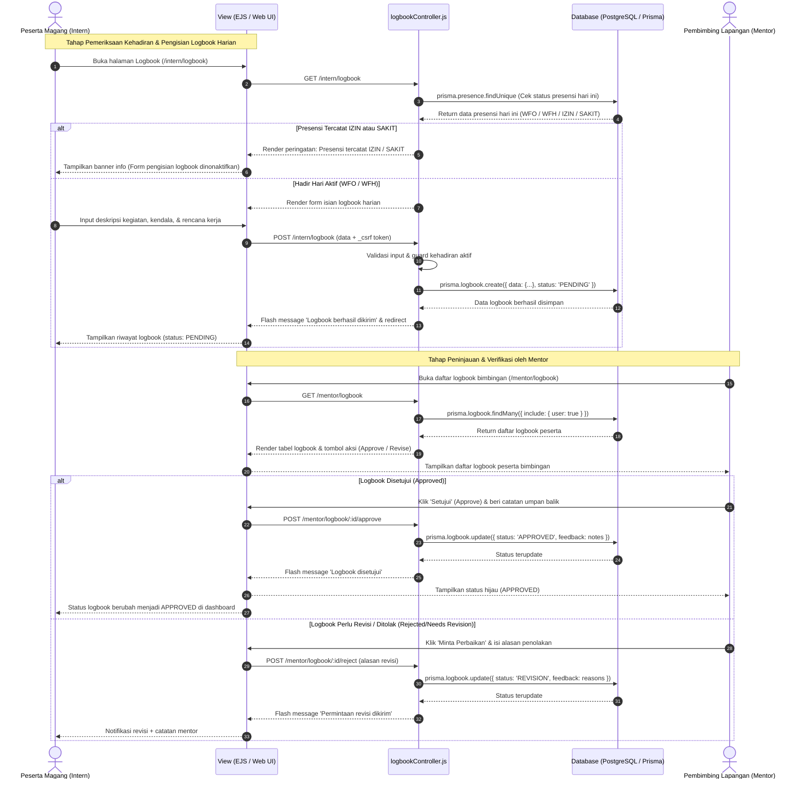

# Sequence Diagram - Pengisian dan Validasi Logbook CIMS

## 1. Deskripsi Alur
Diagram ini menggambarkan interaksi sekuensial antara Peserta Magang (*Intern*), Antarmuka Web CIMS, Kontroler (`logbookController`), Database PostgreSQL (via Prisma), dan Pembimbing Lapangan (*Mentor*).

---

## 2. Diagram Sequence Logbook (Mermaid)

