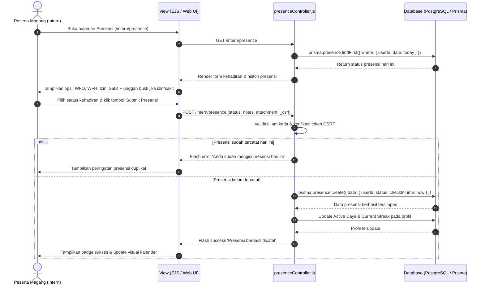

# Sequence Diagram - Presensi Harian CIMS

## 1. Deskripsi Alur
Diagram ini memodelkan proses pencatatan presensi kehadiran oleh peserta magang (status WFO, WFH, Sakit, atau Izin) beserta validasi tanggal dan pembaruan metrik keaktifan (*streak / active days*).

---

## 2. Diagram Sequence Presensi (Mermaid)

