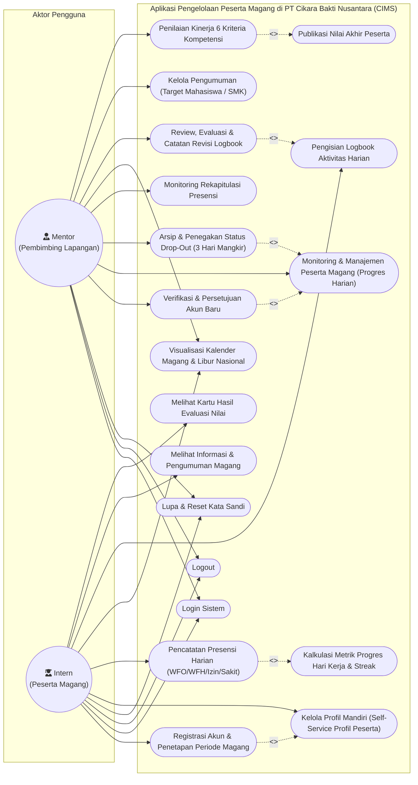

# Use Case Diagram - Aplikasi Pengelolaan Peserta Magang di PT Cikara Bakti Nusantara

## 1. Tujuan Diagram
Diagram ini menggambarkan interaksi fungsional antara aktor (**Mentor / Pembimbing Lapangan** dan **Intern / Peserta Magang**) dengan seluruh *use case* pada **Aplikasi Pengelolaan Peserta Magang di PT Cikara Bakti Nusantara (Cikara Internship Management System - CIMS)**, mencakup relasi fungsional, relasi ketergantungan `<<include>>`, dan relasi kondisional `<<extend>>`.

---

## 2. Diagram Use Case (Mermaid)

---

## 3. Penjelasan Fungsionalitas Use Case

1. **Aktor Mentor (Pembimbing Lapangan):**
   - **Persetujuan Akun (`UC_Approval`):** Memverifikasi pendaftar baru dari perguruan tinggi atau SMK sebelum akun diaktifkan.
   - **Monitoring Peserta (`UC_ManageIntern`):** Memantau progres hari kerja peserta secara ringkas (indikator `H-X/Y`, sisa hari kerja, persentase ketercapaian, dan status keaktifan).
   - **Penegakan Status Drop-Out (`UC_ArchiveIntern`):** Memantau dan mengeksekusi penonaktifan peserta yang mangkir selama 3 hari kerja berturut-turut tanpa kabar ke status `ARCHIVED`.
   - **Tinjauan Logbook (`UC_ReviewLogbook`):** Memeriksa isian aktivitas kerja harian peserta, memberikan status `APPROVED` atau meminta perbaikan (`REVISION`) dengan catatan umpan balik.
   - **Penilaian Kompetensi (`UC_ManageEvaluation` & `UC_PublishEvaluation`):** Memberikan penilaian berbasis 6 kriteria industri dan mempublikasikan kartu hasil evaluasi resmi ke akun peserta magang.

2. **Aktor Intern (Peserta Magang):**
   - **Registrasi & Periode Terkunci (`UC_Register`):** Mendaftarkan diri dengan memilih tanggal mulai dan selesai; sistem secara otomatis menghitung teks periode magang bahasa Indonesia yang bersifat tetap (*immutable*).
   - **Kelola Profil Mandiri (`UC_Profile`):** Memiliki hak penuh mandiri untuk memperbaiki salah ketik (*typo*) nama lengkap, NIM/NIS, institusi (universitas/sekolah), jurusan, kelas, dan kontak HP tanpa ketergantungan pada mentor.
   - **Presensi Harian (`UC_SubmitPresence`):** Mengisi kehadiran harian (WFO, WFH, Izin, Sakit) 1 kali per hari kerja yang sekaligus mereset hitungan mangkir.
   - **Logbook Kegiatan (`UC_SubmitLogbook`):** Mendokumentasikan rincian pekerjaan dan tautan bukti hasil kerja harian.
   - **Pemantauan Capaian (`UC_ViewCalendar`, `UC_ViewEvaluation`):** Memantau kalender kegiatan magang serta melihat kartu hasil penilaian kompetensi yang diterbitkan pembimbing.

3. **Relasi Ketergantungan (`<<include>>` dan `<<extend>>`):**
   - `<<include>>`: Pengisian presensi otomatis memicu kalkulasi progres hari kerja dan *streak* kehadiran; input penilaian mencakup alur penerbitan status penilaian ke peserta.
   - `<<extend>>`: Penegakan status drop-out dan persetujuan akun merupakan perluasan dari modul manajemen peserta; peninjauan logbook memperluas pelaporan logbook oleh peserta.

---

## 4. Dasar Implementasi Source Code

- **Route Utama:** [`routes/index.js`](file:///d:/cims/cims/routes/index.js) dan [`routes/auth.js`](file:///d:/cims/cims/routes/auth.js)
- **Middleware Otorisasi:** [`middlewares/authMiddleware.js`](file:///d:/cims/cims/middlewares/authMiddleware.js)
- **Kontroler Sistem:**
  - [`controllers/authController.js`](file:///d:/cims/cims/controllers/authController.js) (Registrasi, Login, Approval)
  - [`controllers/mentorController.js`](file:///d:/cims/cims/controllers/mentorController.js) (Monitoring Peserta, Arsip & Progres Hari Kerja)
  - [`controllers/presenceController.js`](file:///d:/cims/cims/controllers/presenceController.js) (Presensi & Pengecekan Mangkir)
  - [`controllers/logbookController.js`](file:///d:/cims/cims/controllers/logbookController.js) (Logbook Harian & Paginasi)
  - [`controllers/evaluationController.js`](file:///d:/cims/cims/controllers/evaluationController.js) (Penilaian 6 Kriteria Kompetensi)
